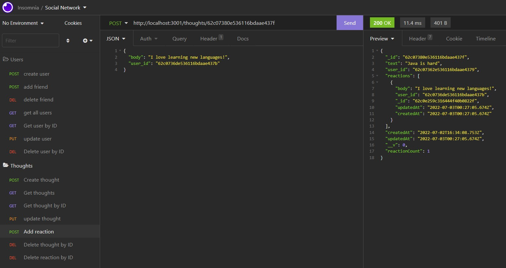

# Social_Newtork_API

## Description:


This is a noSQL database using MongoDB that allows for API endpoints to interact with the database. As this database was created for a social networking platform, the database includes API endpoints for Users, their thoughts, and their friends' reactions to those thoughts.


# Table of Contents 

- [Repository](#repository)
- [Walkthrough Video](#walkthrough%20video)
- [Examples](#examples)
- [Usage](#usage)
- [User Story](#user%20story)
- [Acceptance Criteria](#Acceptance%20criteria)
- [Contributions](#contributing)
- [Tests](#tests)
- [License](#license)
- [Questions](#questions)
- [Technologies Used](#languages)

## Repository: 
- [My Github Profile](https://github.com/Samw1s3)

- [This Repository](https://github.com/Samw1s3/Social_Newtork_API)

## Walkthrough Video
[Link to Full Walkthrough Video](https://youtu.be/bWTDgfsTnG4)

#Screen Shot 

## Examples
* User Object:
* API Route: GET Request ```/users/:id```
* NOTE: performing a GET request without ```:id``` results in a find all query

``` JSON
{
	"user": {
		"_id": "62c07362e536116bdaae4379",
		"username": "Frank",
		"email": "frank@hotmail.com",
		"thoughts": [
			"62c07380e536116bdaae437f"
		],
		"friends": [
			"62c074bb59bb549e0d60ed21"
		],
		"createdAt": "2022-07-02T16:33:38.868Z",
		"updatedAt": "2022-07-03T00:25:21.779Z",
		"__v": 0,
		"friendCount": 1,
		"id": "62c07362e536116bdaae4379"
	}
}
```

* Thought Object:
* API Route: GET Request ```/thoguhts/:id```
* NOTE: performing a GET request without ```:id``` results in a find all query

``` JSON
{
	"thought": {
		"_id": "62c06f6850ba495189ef710b",
		"text": "Java is hard",
		"user_id": "62c06f2950ba495189ef7101",
		"reactions": [
			{
				"body": "i agree",
				"user_id": "62c06edd50ba495189ef70f4",
				"_id": "62c06ffea2d41df74fc0eec7",
				"updatedAt": "2022-07-02T16:19:10.144Z",
				"createdAt": "2022-07-02T16:19:10.144Z"
			}
		],
		"createdAt": "2022-07-02T16:16:40.678Z",
		"updatedAt": "2022-07-02T16:20:01.866Z",
		"__v": 0,
		"reactionCount": 1,
		"id": "62c06f6850ba495189ef710b"
	}
}
```
* Reaction Object: 
``` JSON
"reactions": [
		{
			"body": "I love learning new languages!",
			"user_id": "62c0736de536116bdaae437b",
			"_id": "62c0e259c316444f40b0822f",
			"updatedAt": "2022-07-03T00:27:05.674Z",
			"createdAt": "2022-07-03T00:27:05.674Z"
		}
	],
```

## Usage:

This database gives API endpoints for databse interaction with a soecial networking site. 

## User Story: 

* AS A new social media site
* I WANT an API for my social network that uses a NoSQL database
* SO THAT my website can handle large amounts of unstructured data

## Acceptance Criteria: 

* GIVEN a social network API
* WHEN I enter the command to invoke the application
* THEN my server is started and the Mongoose models are synced to the MongoDB database
* WHEN I open API GET routes in Insomnia Core for users and thoughts
* THEN the data for each of these routes is displayed in a formatted JSON
* WHEN I test API POST, PUT, and DELETE routes in Insomnia Core
* THEN I am able to successfully create, update, and delete users and thoughts in my database
* WHEN I test API POST and DELETE routes in Insomnia Core
* THEN I am able to successfully create and delete reactions to thoughts and add and remove friends to a user’s friend list

## License:
For more information about licenses, please visit:
[License](https://opensource.org/licenses/MIT)

## Contributing:

[](CODE_OF_CONDUCT.md)


## Tests:

Testing completed using Insomnia


## Technologies Used:

* JavaScript
* Node
* Express
* Mongoose


## Questions:


If you have any questions, please see my GitHub Page:

- [My Github Profile](https://github.com/Samw1s3)

- [This Repository](https://github.com/Samw1s3/Social_Newtork_API)


  